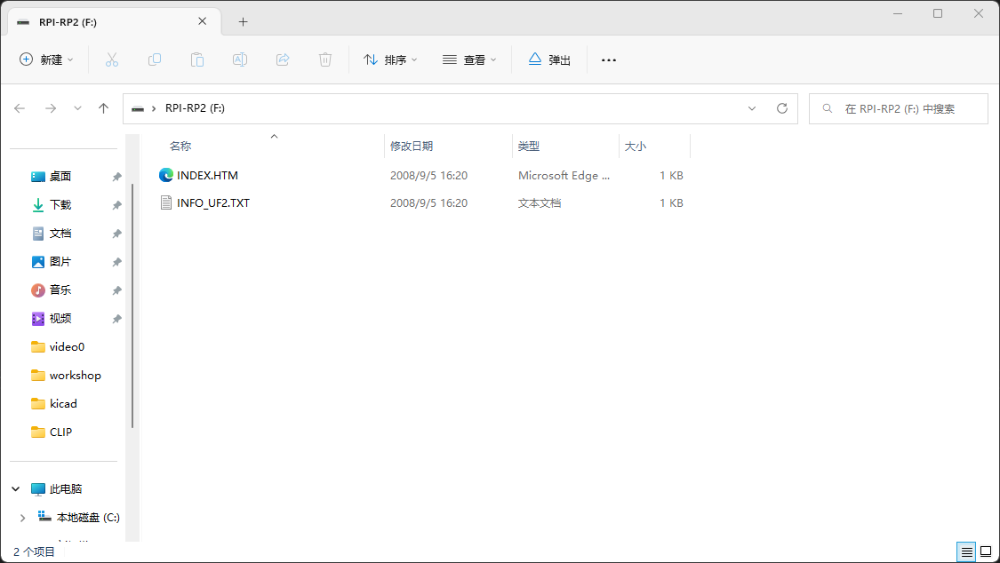

## 目标

:smiley_cat:KiwiDAP的目标是成为一个优秀的高级调试器 , 支持如脱机烧录 , 接口检测 , 无线调试等功能 ...


### 获取kiwidap

* 下载固件[kiwidap.uf2](https://github.com/kiwidap/kiwidap/releases/download/1.0/kiwidap.uf2)  

::: warning
当前固件只支持 Raspberry RP2040 MCU
:::


### kiwidap硬件
* raspberry pico 
* 待续


### 烧录固件
* raspberry pico 
    点击BOOTSEL按键重新上电,出现一个U盘，将下载好的固件拖拽到文件夹即可
    


### Micropython启动脚本 ([thonny](https://thonny.org/))

* 连接Micropython 运行以下程序
``` python
    # 导入模块
    import kiwidap
    import time

    # 定义 DAP 引脚
    SWDIO = 1
    SWCLK = 2
    RESET = 3
    TDI = 4
    TDO = 5

    # 初始化kiwidap
    kiwidap.init(SWDIO,SWCLK,TDI,TDO,RESET)

    # 定义接收 发送 buf
    RXBUFFER = bytearray(64)
    TXBUFFER = bytearray(64)

    # 调用DAP Progress
    while True:
        if(kiwidap.winusb_read(RXBUFFER) == True):
            len = kiwidap.progress(RXBUFFER,TXBUFFER)
            kiwidap.winusb_write(TXBUFFER,len)
            print(RXBUFFER)
            print(TXBUFFER)
        time.sleep_us(1)
```


## kiwidap module API

``` python

* kiwidap.progress(src,dest)

    cmsis dap 数据处理
    src: 数据输入buffer
    dest: 数据输出buffer

* kiwidap.winusb_read(buf) 

    读取 winusb 数据到buf

* kiwidap.winusb_write(buf)

    将buf数据写入 winusb

* kiwidap.usbip_read(buf)

    读取 usbip 数据到buf   

* kiwidap.usbip_write(buf)
    将buf数据写入 usbip


```


## IDE 调试配置
* [Keil](https://www.keil.com/) 
* [openocd](https://gnutoolchains.com/arm-eabi/openocd/)

::: warning
1 Keil 版本不能太低 , 已测试5.25无法识别调试器 , 推荐使用v5.32
2 使用我们提供的最新版openocd

:::
